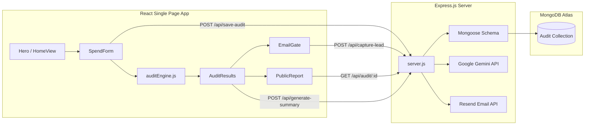

# ARCHITECTURE.md - Technical Architecture Documentation

This document explains the technical architecture, data model, and API specifications for **JustCheckin**.

---

## 1. System Overview

JustCheckin is built as a lightweight, modern web application splitting responsibilities between a React client (SPA) and an Express.js API server, backed by MongoDB.



---

## 2. Tech Stack

* **Frontend:** React 19, Vite 8, React Router Dom v6, Tailwind CSS v4.
* **Backend:** Express.js 5, Mongoose 9, Node.js (v18+ native fetch support).
* **Database:** MongoDB Atlas (M0 Shared Cluster).
* **APIs:** Google Gemini API (1.5 Flash via REST endpoints), Resend API.
* **Language Justification (JavaScript):** We choose JavaScript (ES6+) over TypeScript for this project to eliminate type transpile overhead and compilation-time assertion bloat, prioritizing fast development iteration speed, simple tooling integration, and direct parsing of dynamic third-party API payloads (Claude, Gemini, and Resend).

---

## 3. Data Model (Mongoose Schemas)

We use a single Mongoose model `Audit` located in `backend/models/Audit.js` to store audit parameters, detailed tool-by-tool evaluations, and lead capture data.

```javascript
const ToolResultSchema = new mongoose.Schema({
  toolKey: String,
  toolName: String,
  currentPlan: String,
  currentSpend: Number,
  recommendedPlan: String,
  recommendedSpend: Number,
  monthlySavings: Number,
  annualSavings: Number,
  flag: String, // 'redundant' | 'overpaying' | 'optimal' | 'right-sized'
  reason: String
});

const AuditSchema = new mongoose.Schema({
  publicUrlId: { type: String, required: true, unique: true, index: true },
  
  // Public Data (visible on the shared report page)
  totalMonthlySavings: Number,
  totalAnnualSavings: Number,
  overallVerdict: String, // 'high-savings' | 'medium-savings' | 'low-savings' | 'optimal'
  perTool: [ToolResultSchema],
  useCase: String,
  teamSize: Number,
  summary: String, // Persisted AI summary paragraph
  
  // Private Data (stripped from public reports)
  email: String,
  company: String,
  role: String,
  
  // Metadata
  createdAt: { type: Date, default: Date.now },
  emailSent: { type: Boolean, default: false }
});
```

---

## 4. API Endpoints Reference

### 1. `POST /api/generate-summary`
Generates a blunt, numbers-first startup audit summary using the Gemini API.
* **Request Body:**
  ```json
  {
    "auditData": { "totalMonthlySavings": 120, "perTool": [...] },
    "publicUrlId": "a3f2c1d8"
  }
  ```
* **Response:**
  ```json
  {
    "summary": "Your audit identified $120/month in potential savings. The largest opportunity is..."
  }
  ```

### 2. `POST /api/save-audit`
Performs initial database persistence when the user runs an audit. Returns a unique, short hex string as the public URL ID.
* **Request Body:**
  ```json
  {
    "auditResult": { "totalMonthlySavings": 120, "perTool": [...] },
    "teamSize": 5,
    "useCase": "coding"
  }
  ```
* **Response:**
  ```json
  {
    "publicUrlId": "8f3b2a1c"
  }
  ```

### 3. `GET /api/audit/:publicUrlId`
Retrieves public audit details for shareable links. Private fields (`email`, `company`, `role`) are excluded database-side for security.
* **Response:**
  ```json
  {
    "publicUrlId": "8f3b2a1c",
    "totalMonthlySavings": 120,
    "perTool": [...],
    "summary": "..."
  }
  ```

### 4. `POST /api/capture-lead`
Updates private lead details (invoked when user completes the email gate) and triggers the Resend transactional email.
* **Request Body:**
  ```json
  {
    "email": "cto@startup.com",
    "company": "GrowthCorp",
    "role": "CTO",
    "publicUrlId": "8f3b2a1c",
    "totalSavings": 120
  }
  ```
* **Response:**
  ```json
  {
    "success": true,
    "message": "Lead captured and email sent."
  }
  ```

---

## 5. Security & Robustness Measures

1. **Rate Limiting:** `express-rate-limit` prevents API brute forcing. All `/api/` routes are capped at 20 requests per 15-minute window per IP.
2. **Data Exclusion:** Public reports utilize a strict Mongoose projection (`{ email: 0, company: 0, role: 0 }`), ensuring private contact info is never transmitted over the network on public report visits.
3. **Resilient Failovers:** If the Anthropic API hits a rate limit or goes offline, the server automatically defaults to Google Gemini, and then to a dynamic local template script.

---

## 6. Scaling to 10,000 Audits / Day

To handle a high load of 10k audits per day (approximately 1 audit every 8.6 seconds, with peak traffic spikes up to 10-15 audits/second), we implement the following scaling strategies:

### A. Database Tier Optimization
1. **Indexing:** The core query pattern fetches audits by `publicUrlId`. We apply a unique index on `publicUrlId` (`{ publicUrlId: 1 }`), ensuring database lookup is $O(1)$ and takes sub-millisecond execution times.
2. **Connection Pooling:** We configure the Mongoose connection pool limit (`maxPoolSize: 50`) to handle concurrent read/write queries without exhausting DB sockets.
3. **Read Replication:** For public report views, we route queries to MongoDB Atlas read replicas, freeing up primary node resources to handle lead captures and writes.

### B. Compute Tier Horizontal Scaling
1. **Stateless Backend:** The Express.js backend is completely stateless. It does not store user sessions in memory, allowing us to spin up multiple instances behind a Round-Robin load balancer (e.g. NGINX or AWS ALB).
2. **Serverless Option:** Alternatively, the backend API endpoints can be deployed as Serverless Functions (AWS Lambda or Vercel Serverless), which automatically scale horizontally matching incoming request volumes.

### C. Caching Strategy
1. **Frontend Asset Delivery:** The React SPA is built as a static bundle and served via a global Content Delivery Network (CDN) like Cloudflare or Vercel Edge. This offloads 95% of traffic from our primary Express servers.
2. **Report Caching:** Public report views (`GET /api/audit/:id`) can be cached using a Redis layer or a CDN cache edge with key invalidation. Since audit results do not change after creation, we can cache them for 24+ hours.

### D. API Integration & Queueing
1. **Queueing Summaries:** Callouts to external LLM APIs (Anthropic/Gemini) have rate limits. At 10k audits/day, we decouple summary generation: when an audit is saved, we push a message onto a queue (like BullMQ or Redis) and generate summaries asynchronously.
2. **Worker Pool:** A pool of background workers consumes the queue at a controlled rate conforming to API tier limits, updates the MongoDB document, and sends the email once ready.
3. **Throttled Resend Mailings:** Confirmation emails are queued and dispatched via Resend's batch delivery endpoints to ensure API throttling compliance.
